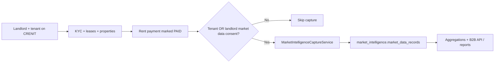

# CRENIT Market Intelligence — Strategy & Technical Reference

This document answers how market intelligence data is **collected**, **presented**, **sold**, and whether it is **valid** and **trustworthy** — based on the current CRENIT implementation (`apps/api/src/market-intelligence/`, migration `0006_market_intelligence.sql`, and related UI).

---

## 1. What “market intelligence” means at CRENIT

CRENIT’s data product is **verified rental intelligence**, not a general property portal scrape.

| Included today                                                      | Not included today                                          |
| ------------------------------------------------------------------- | ----------------------------------------------------------- |
| Rent actually paid through CRENIT (gross amount on `PAID` payments) | Listing / asking prices from Facebook, agents, etc.         |
| Payment behaviour (on-time, late, days to pay)                      | Sale deed / transfer prices (roadmap only)                  |
| Suburb, property type, bedrooms, coarse geo                         | Street-level address or tenant/landlord identity in exports |
| Income **bracket** (only if tenant consented)                       | Exact salaries in B2B outputs                               |

Positioning (from `data-product-catalog.ts`):

> *Anonymised, consent-based rental intelligence derived from confirmed platform payments — not listings, estimates, or sale deeds.*

---

## 2. How data is collected

### 2.1 Flywheel (intended production path)

1. **Users join** and optionally grant consent at onboarding:
  - Tenants: checkbox on KYC submit → `POST /consent/market-intelligence` with `TENANT_MARKET_DATA`
  - Landlords: checkbox when adding a property → `LANDLORD_MARKET_DATA`
  - Signup can also pass `market_data_consent` on register (`auth.service.ts`)
2. **Rent runs on-platform** — lease linked to unit → property (suburb, type, geo).
3. **On `PAID`** — `payments.service.ts` calls `MarketIntelligenceCaptureService.captureFromPayment()` (automatic; not a user button).
4. **One anonymised row per payment** is written to `market_intelligence.market_data_records` with:
  - `verified_rent_amount`, `payment_status`, `days_to_pay`, `month_year`
  - `suburb`, `city`, `property_type`, `bedrooms`, `geo_lat` / `geo_lng`
  - `tenant_hash` / `landlord_hash` (SHA-256 of user id + salt prefix — not reversible to profile in API)
  - Optional: `income_bracket`, `deposit_ratio`, `lease_start_date`
  - **No** names, emails, phones, street addresses, or raw user IDs in the record
5. **Consent rule:** capture runs if **either** tenant **or** landlord has active consent (not both required).
6. **PII guard:** `assertNoPiiFields()` blocks writes that include prohibited keys; can log `MARKET_DATA_PII_BLOCKED` to admin audit.

### 2.2 What gets skipped (data gaps)

Capture is **not** collected when:

- Payment is not `PAID`
- No `tenant_id` on payment
- Neither party has market data consent
- Property has no `address_suburb` (context load fails)
- Row already exists for that `payment_id` (idempotent)

So volume grows only with **real CRENIT payment volume** in consented leases — not with every landlord on the platform.

### 2.3 Secondary / demo data path (important)

There are **two** storage layers:

| Layer                 | Table                                     | Used when                                 |
| --------------------- | ----------------------------------------- | ----------------------------------------- |
| **Verified pipeline** | `market_intelligence.market_data_records` | Live captures from payments               |
| **Snapshots**         | `public.market_data_snapshots`            | Seed data + fallback when no live records |

`MarketIntelligenceService.fetchMergedRecords()` chooses **per suburb**: live records when n ≥ 5, else latest snapshot; city-level `data_source` may be `mixed`.

The **landlord UI** (`/landlord/market-data`) calls **`/market-data/*`** (landlord/admin auth), which delegates to the same service as B2B. Detail view shows overall on-time rate (aligned with lender-risk), bedroom and income breakdowns, and monthly rent / on-time charts.

---

## 3. How data is presented

### 3.1 Landlord portal (operational)

- **Route:** `/landlord/market-data` (locked until partner verification)
- **API:** `GET /market-data/summary`, `/market-data/suburbs`, `/market-data/suburbs/:name`
- **Shows:** suburb list, median rent, on-time rate, trend vs previous snapshot
- **Audience:** landlords pricing units — internal benchmark, not a licensable export

### 3.2 Admin — Data Intelligence console

- **Route:** `/admin/data-intelligence`
- **API:** market-intelligence admin routes (dashboard, suburb explorer, B2B clients, API keys, report generation)
- **Shows:** KPIs, volume trends, suburb rankings, property mix, payment status mix, methodology, buyer personas, sample/confidence counts
- **Can generate PDF reports** (`generateReportPdf`) for product types in catalog

### 3.3 B2B API (licensed buyers)

- **Base:** `GET /api/v1/...` with header `X-CRENIT-Key` (or legacy `X-RentCredit-Key`)
- **Endpoints:**
  - `GET /api/v1/suburb/:name` — rent distribution, bedroom breakdown, on-time trend, income bands, compliance envelope
  - `GET /api/v1/suburb/:name/trends` — on-time trend series only
  - `GET /api/v1/city-overview` — Windhoek-wide suburb comparison
  - `GET /api/v1/lender-risk/:suburb` — underwriting pack (stub when n &lt; 5)
  - `GET /api/v1/reports`, `/reports/:type/preview`, `/reports/:type/pdf` — licensed PDF reports
- **Controls:** API key hash, client subscription status, hourly rate limits, tier daily caps, `api_usage_logs`

### 3.4 Marketing & commercial pages

- Landing page flywheel copy (rent → credit → market data)
- `/products` — “Data Intelligence” product tile
- Catalog constants: `REPORT_PRODUCT_CATALOG`, `BUYER_PERSONAS`, `DATA_INTELLIGENCE_METHODOLOGY`

### 3.5 Each suburb response includes trust metadata

- `transaction_count` / effective sample size
- `confidence_level`: `insufficient` | `low` | `moderate` | `high` (thresholds 5 / 10 / 25 records)
- `licensing_notice` — e.g. “directional only” vs “investor-grade”
- `commercially_licensable` when n ≥ 10
- `freshness_status` on list views (fresh / stale / inactive by last capture age)
- `pricing_guidance` — rent comps ≠ sale price

---

## 4. How it is sold (commercial model)

### 4.1 Buyer personas (defined in code)

| Persona                 | Typical use                                            |
| ----------------------- | ------------------------------------------------------ |
| Developers              | Feasibility rent, unit mix                             |
| Estate agents / valuers | Asking rent evidence                                   |
| Banks                   | Neighbourhood payment behaviour, income-to-rent stress |
| Contractors / PM        | Suburb benchmarks                                      |
| Government / research   | Aggregated affordability                               |
| Investors               | Suburb yield comparison                                |

### 4.2 Product shapes

| Channel                  | Access tier (DB)       | Example deliverables                         | Indicative NAD (seed)                        |
| ------------------------ | ---------------------- | -------------------------------------------- | -------------------------------------------- |
| **One-time report**      | `One-time report`      | Suburb PDF + structured stats                | Suburb report N$2,500; City overview N$8,500 |
| **Monthly subscription** | `Monthly subscription` | Ongoing explorer + report quota              | Client-specific                              |
| **API access**           | `API access`           | Machine-readable suburb / city / lender-risk | Rate-limited keys                            |

Report types in DB (`report_products`):

- `suburb_report`
- `city_overview`
- `lender_risk_pack`
- `development_feasibility`

### 4.3 Licensing rules (enforced in product logic, not just legal PDF)

- Only **aggregates** leave the platform; minimum sample before suburb is “sold”
- Suburbs below 5 records: blocked or `minimum_sample_not_met`
- 5–9: “directional” (`low` confidence)
- 10–24: “moderate” — suitable for licensed reports with disclosure
- 25+: `high` — API + institutional use cases

External licence terms (catalog): no re-identification, cite CRENIT + sample size, rental domain only until sale comps launch.

### 4.4 Roadmap revenue line (not live)

**Sale comps** (`SALE_COMPS_ROADMAP` in `data-product-catalog.ts`): partner-fed deed/transfer data, separate schema and API — explicitly **not** mixed with rent payment pipeline.

---

## 5. Is it valid?

**Valid for a defined claim:**  
*“Among CRENIT-verified rental payments in suburb X, this is the distribution of paid rent and payment timing.”*

**Not valid for a broader claim:**  
*“This is the true Windhoek market rent for all properties.”*

| Validity factor            | Assessment                                                                                                                                          |
| -------------------------- | --------------------------------------------------------------------------------------------------------------------------------------------------- |
| **Transaction truth**      | Strong **if** payment is genuinely confirmed on-platform (landlord confirm or instant methods) — amount is what was recorded as paid                |
| **Representativeness**     | Weak until platform has meaningful share of rentals in a suburb — sample is **biased** to CRENIT users                                              |
| **Geographic accuracy**    | Depends on property `address_suburb` quality; no independent geocode audit                                                                          |
| **Income bracket**         | Only when tenant consented; derived from `profiles.income_monthly` if populated                                                                     |
| **Comparison to listings** | Not comparable — asking rent ≠ verified paid rent                                                                                                   |
| **Statistical rigour**     | Min-sample gates and confidence tiers are implemented; not a full statistical model (no seasonality adjustment, no mix-weighting by property stock) |

**Operational validity checklist before selling a suburb:**

1. `data_source` is `market_data_records` (not snapshot fallback)
2. `transaction_count` ≥ 10 for “moderate” commercial use
3. `freshness_status` is `fresh` (< 90 days since last record)
4. Disclose “CRENIT verified sample” in every client deliverable

---

## 6. Can it be trusted?

### 6.1 Trust strengths (built into the system)

1. **Consent-first** — no capture without `data_sharing_consents`
2. **Payment-grounded** — not user-typed “my rent is X” on a form
3. **Anonymisation** — hashed IDs; PII field block list on insert
4. **Transparency in API** — confidence, licensing notice, sample count, data domain
5. **Separation of rental vs sale** — methodology states sale deeds are out of scope today
6. **Auditability** — `report_generations`, `api_usage_logs`, admin dashboard shows pipeline source

### 6.2 Trust risks (be explicit with buyers)

| Risk                                   | Mitigation                                                                  |
| -------------------------------------- | --------------------------------------------------------------------------- |
| Low volume / empty suburbs             | Do not license; show `insufficient`                                         |
| Demo snapshots mistaken for live data  | Unify landlord UI on intelligence API; label `data_source` in UI            |
| Selection bias (only digital adopters) | Disclose in methodology; target bank/dev clients who want *verified* cohort |
| Consent OR not AND                     | Stricter policy possible: require both parties                              |
| Simulated payments in dev              | Production gate + exclude test tenants                                      |
| Income self-reported                   | Bracket only; never export exact income in B2B                              |
| Suburb mis-labelling on property       | QA on landlord property setup; optional geocode later                       |

### 6.3 Trust narrative for B2B sales

Recommended wording:

> “CRENIT Data Intelligence is a **verified rental payment dataset** from the CRENIT platform. It is stronger than listing scrapes for **what tenants actually paid and when**, weaker as a **census of every lease in Namibia**. Every export includes sample size and confidence tier.”

---

## 7. Product improvements

### Shipped

- Landlord UI unified on intelligence pipeline; `data_source` badge (verified / snapshot / mixed).
- Per-suburb merge, B2B compliance envelope, lender-risk stub when n &lt; 5, `/api/v1/suburb/:name/trends`.
- Nightly snapshot rollup + admin manual rollup; consent revoke in tenant/landlord settings.
- Admin “Ready to license” report + methodology PDF download.
- Landlord detail: overall on-time %, bedroom/income blocks, monthly on-time and rent charts; summary on-time weighted by sample count.
- B2B licensed report PDF + preview on `/api/v1/reports/*` (audited via `report_generations.client_id`).
- OpenAPI 3.0 + Postman exports; `GET /api/v1/openapi.json`.
- Licensable suburb webhooks (`suburb.licensable`, migration `0028`); admin delivery log + test send.
- Sale comps pilot ingest + `GET /api/v1/suburb/:name/sale-comps`; landlord `/market-data/suburbs/:name/sale-comps`.
- Landlord rent vs suburb median: `GET /market-data/compare`.
- Admin **Data QA** tab: geocode/suburb mismatch report (`GET /admin/data-intelligence/geocode-qa`).
- Sale comps **CSV upload** (`POST /admin/data-intelligence/sale-comps/csv-ingest`).
- Webhook delivery filters: failed only / pending retry.
- Landlord **email + in-app** alert when their suburb becomes licensable (migration `0030`).

### Backlog

1. **Sale comps GA** — partner SLA, bulk ingest, separate licence SKU (pilot tables live).
2. **Stricter consent** — optional require tenant **and** landlord consent before capture.
3. **Geocode QA** — reduce suburb mis-labelling on properties.
4. ~~**Webhook retries**~~ — shipped: exponential backoff (15‑min cron + admin retry); migration `0029`.
5. ~~**Dual consent mode**~~ — opt-in via `REQUIRE_DUAL_MARKET_CONSENT=true` on API.
6. **Sale comps GA** — partner SLA, pricing SKU, deed bulk pipelines.

---

## 8. File reference

| Area                          | Path                                                                                  |
| ----------------------------- | ------------------------------------------------------------------------------------- |
| Capture on payment            | `apps/api/src/market-intelligence/market-intelligence-capture.service.ts`             |
| Aggregations + PDF + API data | `apps/api/src/market-intelligence/market-intelligence.service.ts`                     |
| B2B HTTP API                  | `apps/api/src/market-intelligence/data-intelligence-api.controller.ts`                |
| B2B integrator guide          | `docs/B2B_INTEGRATOR_GUIDE.md`                                                        |
| Admin B2B playground          | `apps/web/app/admin/data-intelligence/B2bApiPlayground.tsx`                             |
| Commercial catalog            | `apps/api/src/market-intelligence/data-product-catalog.ts`                            |
| Comparison utils              | `apps/api/src/kyc/kyc-location.util.ts` (tenant address; separate from MI rent comps) |
| Consent                       | `apps/api/src/market-intelligence/consent.service.ts`                                 |
| Schema                        | `supabase/migrations/0006_market_intelligence.sql`                                    |
| B2B compliance envelope       | `apps/api/src/market-intelligence/market-intelligence-response.util.ts`             |
| Landlord portal API           | `apps/api/src/market-data/market-data.controller.ts`                                  |
| Landlord UI                   | `apps/web/app/landlord/market-data/page.tsx`                                          |
| Admin console                 | `apps/web/app/admin/data-intelligence/page.tsx`                                       |

---

*Last updated: June 2026*